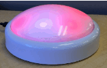
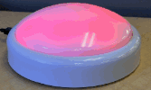
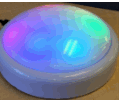

# Autobot Button

An Arduino/Bluefruit Micro button and status light designed for triggering an action with the tap of a large button and
receiving feedback.

# Usage

There are seven states the button can be in, and 1 action that can be performed.

## States

### Disconnected
When the button is not connected to a listener via Bluetooth LE, it will be red and cycle a magenta cursor.
It will not respond to presses during this state.

### Connected
When the button connects to a listener via Bluetooth LE, it will temporarily pulse blue and then fade to white.

### Pending

Once the button is pressed, the cursor will circle the button so the user sees their action has been registered. The
overall color will remain what it previously was as of the last known state sent from the listener.

### Good

When the listener responds with the state of `GOOD`, the button will fade to green from the previous color.

### Warning
When the listener responds with the state of `WARN`, the button will fade to amber from the previous color.

### Error
When the listener responds with the state of `ERROR`, the button will fade to red from the previous color.

### Unknown

When the listener responds with an `UNKNOWN` state, the button will cycle a rainbow.

## Actions

There is currently only one action that can be performed by the button, pressing it. Multiple presses will send multiple
press events to the listener, it is up to the listener to ignore presses if an action is currently pending.

# Contributing

## Circuit
TODO: Diagram and instructions to come

## Programming the Bluefruit Micro
Use the Arduino Development Environment to upload `deploy_button.ino`

# BLE Protocol (UART)

The button connects to a listener via Bluetooth LE using a UART TX and RX service.

## TX
The button will send the characters `GO` when it is pressed.

## RX
The button listens to the `RX` characteristic for single ASCII characters representing the numeric state it should
display.  For example, if an ASCII `'2'` (not the hex value `0x02`) is sent over UART RX, the button will turn green
(for the `GOOD` state.) A full list of possible states and their number value are `#define`-ed in `deploy_button.ino`